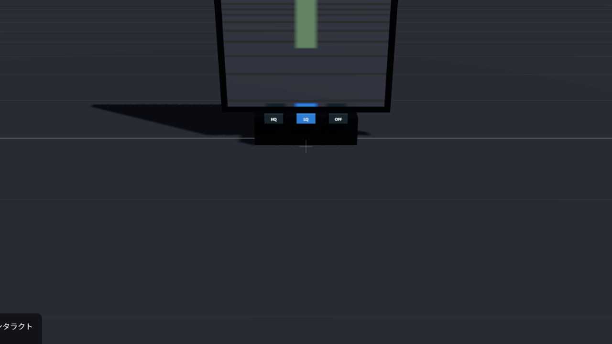

# xrift-mirror 🪞

**[XRift](https://xrift.net/) 用の切替スイッチ付き姿見ミラー** — VRChat ワールドの定番ギミック「HQ/LQ 切り替えミラー」を、XRift のワールドとアイテムの両方に持ち込んだものです。

*A switchable HQ/LQ/OFF stand mirror for XRift worlds & items.*



## できること

- 右端の縦スイッチで **HQ / LQ / OFF** の3モードを切替。XRift ワールドではモードを **全員に同期**（VRChat のミラースイッチと同じ流儀）
- **HQ** = 全景を映す高画質ミラー（解像度1024）／**LQ** = **アバターだけ映る**軽量ミラー（解像度512）／**OFF** = 鏡を外して枠だけ（描画コストゼロ）
- LQ は VRChat の LQ ミラーと同じ発想: 鏡のコストの本命は「シーンをもう一回描くドローコール」で、解像度ではなく **映す対象をアバターだけに絞る** ことでそれを削ります
- 鏡は色を混ぜない恒等ミラー（色かぶり・脱色なし）
- 現在のモードのスイッチが青く光る。ラベル常時表示（VR でも読める）
- 10m 以上離れると反射レンダリングを自動停止して消灯ガラスに落とす（距離LOD・ヒステリシス付き）
- ワールド設置版は **幅・高さを自由に指定できる**

## XRift ワールドに置く

```bash
npm install xrift-mirror
```

```tsx
import { XRiftStandMirror } from 'xrift-mirror/xrift'

export const World = () => (
  <>
    {/* 任意の位置・向き・サイズで置ける。複数置くなら syncId を変える */}
    <XRiftStandMirror position={[0, 0, -3]} width={2.4} height={2.2} />
  </>
)
```

| prop | 既定 | 説明 |
| --- | --- | --- |
| `position` | `[0, 0, 0]` | 設置位置（台座の足元） |
| `rotationY` | `0` | Y回転。鏡面は +Z を向く |
| `width` | `1.6` | 鏡面の幅（m）。枠はこれより一回り大きい |
| `height` | `2.2` | 鏡面の高さ（m） |
| `defaultMode` | `'off'` | 初期モード。ワールド備え付けは `'off'` 推奨（Quest 配慮の VRChat ミラー作法） |
| `syncId` | `'xrift-mirror'` | 同期キー兼ボタンidの名前空間。複数設置時は一意にする |

## XRift 以外の React Three Fiber でも使える

v0.3.0 から実装を二層に分けました。本体はどの R3F プロジェクトでも動きます。

- **`xrift-mirror`（本体）** — 依存は `three` / `@react-three/fiber` / `@react-three/drei` / `@react-three/rapier` のみ。**`@xrift/world-components` には依存しません**
  - `StandMirror` — スイッチ付き姿見。モードはローカル state（`mode` / `onModeChange` で外部制御も可）。スイッチは R3F のポインタイベントで反応し、`renderInteract` で任意のインタラクション実装に差し替え可能
  - `MirrorSurface` — 鏡面だけ（枠・スイッチなし）。`quality="hq" | "lq"`
  - `LayeredReflector` / `tagAvatarsForMirror` — 低レベルAPI（下記「実装」参照）
- **`xrift-mirror/xrift`（アダプタ）** — `XRiftStandMirror`。XRift の `useInstanceState`（全員同期）と `Interactable`（VRコントローラ/デスクトップ両対応の操作）を `StandMirror` に注入する薄い層。`@xrift/world-components` への依存はここだけ（optional peerDependency）

```tsx
// 素の R3F プロジェクト（XRift 不要）
import { StandMirror } from 'xrift-mirror'

<StandMirror position={[0, 0, -3]} defaultMode="hq" />
```

## アイテム版

このリポジトリは XRift アイテム「ミラー」としてもビルドされます（`npm run build` → `xrift upload item`）。アイテム版はインベントリからどのワールドにも持ち込める **サイズ固定の大型ミラー（3.6m × 2.85m）** で、既定モードは LQ（アバターだけ映る）です。

ワールドにミラーが備え付けてあるのが常識の VRChat に対して、「鏡を自分で持ち歩く」は XRift のアイテム機構だからできる形です。

## 実装 — 「アバターだけ映る」の仕組み

鏡面は three.js の [`Reflector`](https://github.com/mrdoob/three.js/blob/dev/examples/jsm/objects/Reflector.js)（MIT）をフォークした `LayeredReflector` です。反射用の仮想カメラを自前で所有し、`reflectLayersMask` で「鏡に何を映すか」を選べます。

- XRift のアバターは three-vrm の VRMFirstPerson 層規約（9=一人称専用・10=三人称専用）を使いますが、体の大半は layer 0 でワールドと同居しているため、既存レイヤーだけでは分離できません
- そこでシーンを定期走査して **SkinnedMesh（アバター≒スキンメッシュ）とライトに鏡専用レイヤー（30番ビット）を追加** します。Layers はビットマスクなので既存のレイヤー運用に対して非破壊です
- LQ の仮想カメラはこの鏡専用レイヤーだけを描画 → 反射パスのドローコールがアバター数体分まで減ります
- HQ は一人称専用レイヤー(9)だけを除いた全景を描画（一人称の頭・体が二重に映るのを防ぐ）

既知の限界: アバターに追従する **非スキンの剛体アクセサリは LQ では映りません**（SkinnedMesh 検出のため）。

## クレジット

- 参考: BOOTH [HQ・LQ切り替えスイッチ付ミラー](https://booth.pm/ja/items/3640350) ほか VRChat のワールドギミック文化
- 鏡面の反射数学は three.js [`Reflector`](https://github.com/mrdoob/three.js/blob/dev/examples/jsm/objects/Reflector.js)（MIT License, Copyright 2010-2026 three.js authors）のフォーク。それ以外（レイヤー制御・アバター検出・LOD・スイッチUI）は React Three Fiber でゼロから書いています

## 開発

```bash
npm install
npm run dev        # DevEnvironment 上で単体プレビュー（?preview で設置プレビュー確認）
npm run build      # XRift アイテムビルド（Module Federation → dist/）
npm run build:lib  # npm ライブラリビルド（→ lib/）
npm run typecheck
```

dev シーンには LQ 検証用のダミーアバター（SkinnedMesh・赤）と静的な青箱が置いてあります。期待値: HQ=両方映る / LQ=赤だけ映る。

## ライセンス

MIT
